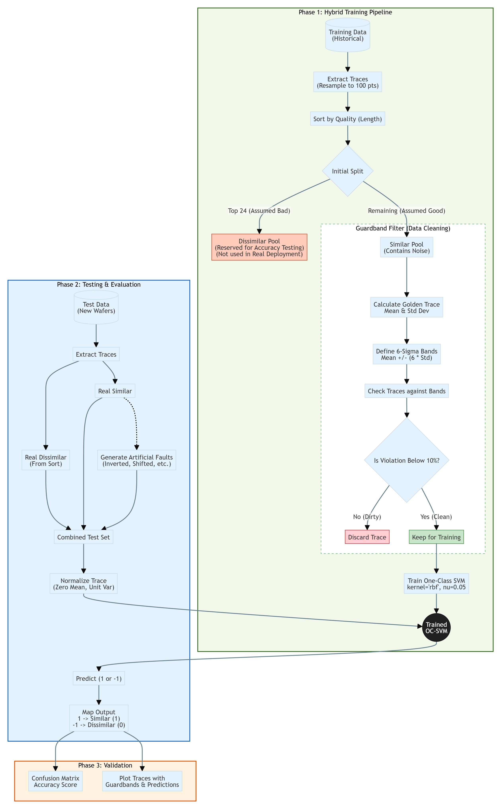
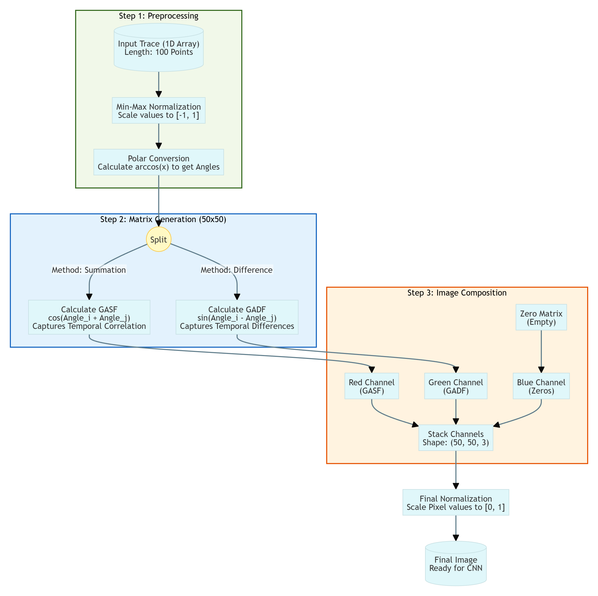
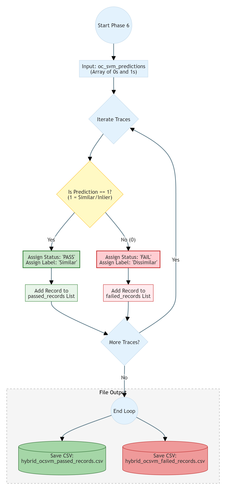
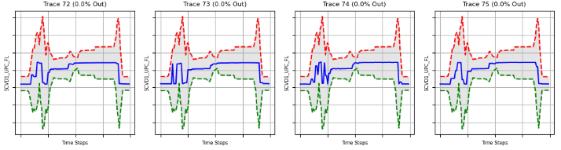
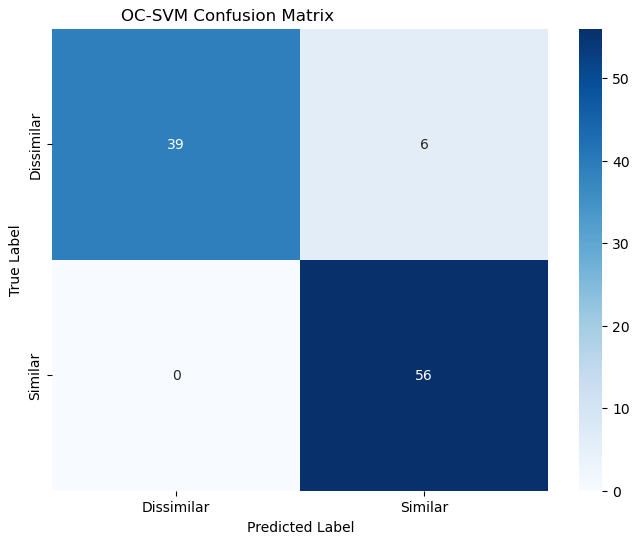

# Fault Detection in Semiconductor Manufacturing: A Hybrid Guardband-OC-SVM Approach

**Author:** Lin Xiaoya  
**Context:** Internship Project (GlobalFoundries - TPC Team)

> **⚠️ Note:** This repository serves as a portfolio demonstration of the methodology and results. Due to Non-Disclosure Agreements (NDA) and Intellectual Property protections, the proprietary source code and raw production data cannot be shared. This repository uses synthetic data to demonstrate the logic.

## 🎥 Project Demo

  
---

## 📌 The Challenge

Semiconductor manufacturing generates terabytes of sensor time-series data daily. Detecting equipment faults in this stream faces three core challenges:

1.  **Silent Faults:** Traditional Statistical Process Control (SPC) misses subtle, shape-based anomalies (e.g., a transient pressure spike) because it relies on simple averages.
2.  **Data Contamination:** Historical data used for training unsupervised models is often "dirty," containing unlabeled anomalies.
3.  **Boundary Smearing:** When standard One-Class SVMs are trained on dirty data, they learn a "loose" boundary, resulting in poor sensitivity.

---

## 💡 The Solution: Hybrid Guardband-OC-SVM

I developed a two-stage hybrid architecture that combines statistical filtering with machine learning to create a robust, unsupervised anomaly detector.

*Figure 1: The Hybrid Training Pipeline. Guardband filters clean the data before OC-SVM training.*

### Phase 1: Guardband Filtering (Data Hygiene)
Before machine learning training begins, raw historical traces are passed through a **6-Sigma Statistical Guardband**.
* **Logic:** A "Golden Trace" is calculated from the population mean.
* **Filtering:** Any trace deviating significantly (>10% points outside 6σ) is automatically discarded.
* **Result:** A statistically "clean" training set is curated without human labeling.

### Phase 2: One-Class SVM (Shape Learning)
The cleaned data is fed into a **One-Class Support Vector Machine (OC-SVM)** with an RBF kernel.
* Unlike SPC, the SVM learns the *non-linear shape* of the process.
* Because the training data was pre-cleaned, the SVM can draw a very tight decision boundary, maximizing sensitivity to new faults.

---

## 🧠 Feature Engineering: Trace-to-Image

To enable advanced analysis (and comparison with CNN benchmarks), time-series data was transformed using **Gramian Angular Fields (GAF)**. This converts temporal correlations into a 2D spatial structure.

*Figure 2: Transforming 1D time-series sensor data into 2D polar coordinate images.*

---

## ⚙️ Execution Logic: Pass/Fail Update

The system includes an automated logic layer that segregates results based on the OC-SVM predictions, ensuring engineers only review relevant failures.

*Figure 3: The decision logic for sorting traces into Passed or Failed logs.*

---

## 📊 Results & Validation

The hybrid model was benchmarked against standard methods on a balanced test set of 101 traces.

### Performance Metrics
| Model Architecture | Precision (Anomaly) | Recall (Anomaly) | Overall Accuracy |
| :--- | :--- | :--- | :--- |
| **Standard Guardband (SPC)** | 0.86 | 0.81 | 81.19% |
| **Standard OC-SVM (No Filter)** | 0.79 | 0.70 | <75.00% |
| **Hybrid GB-OC-SVM (My Model)** | **1.00** | **0.89** | **95.05%** |

### Visual Verification
The demo script visualizes the decision boundary. The plot below shows how the Hybrid model identifies anomalies (Red) vs Normal traces (Green).

  
*Figure 4: Real-time visualization of trace classification. Red bands indicate the statistical guardbands.*

### Confusion Matrix
The model achieved near-perfect precision, eliminating false alarms which is critical for fabrication efficiency.

  
*Figure 5: Confusion Matrix showing zero False Positives (Precision = 1.0).*

---

## 🛠️ Tech Stack
* **Language:** Python
* **Data Processing:** Pandas, NumPy, Scipy (Interpolation)
* **Machine Learning:** Scikit-Learn (One-Class SVM), PyTorch (LSTM/CNN Benchmarks), Optuna (Hyperparameter Tuning)
* **Visualization:** Matplotlib, Seaborn

## 📜 License
This documentation is shared under the MIT License. The underlying implementation and data remain the property of GlobalFoundries.
* **Machine Learning:** Scikit-Learn (One-Class SVM), PyTorch (LSTM/CNN Benchmarks), Optuna (Hyperparameter Tuning)
* **Visualization:** Matplotlib, Seaborn

## 📜 License
This documentation is shared under the MIT License. The underlying implementation and data remain the property of GlobalFoundries.
